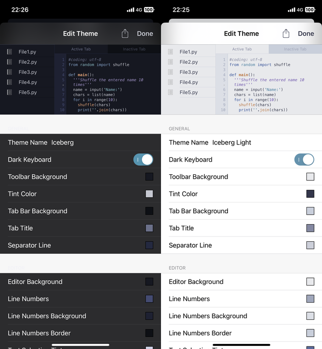

# pythonista-iceberg-theme

Editor color theme for [Pythonista for iOS](https://omz-software.com/pythonista/).

Original [iceberg.vim](https://github.com/cocopon/iceberg.vim) (reference: [cocopon/vscode-iceberg-theme: Dark blue color theme for Visual Studio Code](https://github.com/cocopon/vscode-iceberg-theme)) for Vim by [cocopon (Hiroki Kokubun)](https://github.com/cocopon).



> [!WARNING]
> Use at your own risk! User themes aren't "officially" supported, and this may break in future versions.
> If you enter invalid JSON or anything else that the app can't deal with, it *will* crash -- your input is not validated in any way.  
> 自己責任で使用してください。ユーザーテーマは "公式に "サポートされていませんので、将来のバージョンでは壊れるかもしれません。 無効なJSONやアプリが処理できないものを入力すると、クラッシュします。


## How to Install

On your device, "`| Tap on this Link |`". If Pythonista 3 is installed, it will ask you to open the app. Tap `Open` to install it.

**Or**, copy the string displayed in "URL scheme raw", display it as a hyperlink on Pythonista3, and tap it.


Pythonista3 がインストールされているデバイスで、`"| Tap on this Link |"` をタップ。「"Pythonista"で開きますか?」の表示で、「開く」を選択。

**または、**「URL scheme raw」の文字列をコピー。Pythonista3 等で、ハイパーリンク形式にして開く。

### Iceberg

#### HyperLink

[| Tap on this Link | `iceberg.color-theme.json`](https://tinyurl.com/ylyqpsoo)

#### URL scheme raw

```
pythonista3://?action=add-theme&theme-data=eNqtVk1zozAMvfdXZNJrKB-hCck_6Mzurae9MP4QiQvYjG26zXT639c2EAiFJtPtLbGepGc9WeL9brFM0xTV-ihkylEJy_1iSQQRleDLVWPNWAFnGyOAQR4eiCiE9PQRSnh4USNwLQuLPWpdqb3vH5g-1ti4lH4b2n9VRFDw2mhNHB8XAvslYtx3_5V_LVlhAFxBmjNObcLfT8-LX81ZB6lqdQSaIm3tURCtvSD0wu1zGO3j3f5x-6cDSqiEYlrI0zfpu0AYkfwgRd3wuQ83YRKFrUWm81aKZJ7mcMICSWvUsgZ3DhmqC51qeHM3uCcbktDGB6ilmyKimeAqZUTwcYYIrcPHZBatGW-jUhrCZgpXmfu-wmfqEIXrqHGQ0uDPBCHaJtsm5aHW-kvXDiAkBemMAYRB-OiMhhtIpZlmyMlxn2VBkGXOVjAskVFqvqAd4nzFDd4Gya61cdPQdYnbpHEc423j1rX5U6OsOzNaV6DM6fvdwugoCtr-XiwzwbWn9KlwTs5kzj9WHdBjGpkm_QLfIXq3mhWGdFZzp8DZ1b2BYQucPcgRSI7FWw_tD2wffQJ6VHCYQ6_cYYu4dC-QUrfwsTjTuPPQ1dXi2ed19u9V9vpQvZ4OLjlITyLKaksxegguQpnJQnKTC0k9wQoFuzXZDpOXJfAp5EXSS_5jHSkYUkg7x3EYHGNIoiHWvfIbaksFUVoyfpi_xi3kQBFUXSlwEqOAbHqfTMgSaT2duy1MD55vX4hQbAbEJ-h0x7To6x1zBCM-P3jhTwSJfiLI-n-CfDk4xnKaxfFXSDqRbyyiGX35PKyhZUe517ZvI-HSdAZIOzb7SKXZWNA3tx0rk23Uj_sO5aa9N5N8gNAn16Jxn1LQuoAp-juckMF7Os_2ay-9kuIFiL5pns--u3F2jXrURC25GJZRI5WP5vE48KwqllEOotYu3J2LuFRQITd3UqeX-wqIo10cuF2mER4vzcHKtVazcJvbDzemTZ4qKMC91MnvBvONVGKOWDGzznufdqR9_AO4tfnb
```

### Iceberg Light

#### HyperLink

[| Tap on this Link | `iceberg-light.color-theme.json`](https://tinyurl.com/yl6vz2lz)

#### URL scheme raw

```
pythonista3://?action=add-theme&theme-data=eNqtVk1z4jAMvfdXMPRKGiDQAP-gM7u3nvaScWyFuHHsjK10y3T2v6_jfEFICrPbG1jvSbL0LOXzYTaPooiUmCodSZLD_DCbU0VVoeR8UVsTLqCzcQox6KMn-DHFJ6qE0h6mkMPTmxlQSi0qRopYmIPvHzmmZWwpud8E8N8NVQy81qfz48dCxX5OuPTdf-PfF1JYmDQQZVyyKuzPl9fZj_qshRSlSYFFBCv7erkOvOXKW4Wvq_Vhsz9sw18tUEOhDEelT_94CecoJjQ7alXW-TzCDvZAG4uOpq2M6CzK4BQroisj6hLcOSSkFBghfLgbPAZBEG5qDrAq3YhQ5EqaiFMlhxEoYUsGk2jksva63T3H-1FcYe_7DlepM8oSCGuC1hbfJUjpdhUSZzmWiF9SW4DSDHTN3tGEMWe0uYE2yJET147HJFkuk8TZBI81sZ2aLmiL6K64C3Z7EjQ2acVd5nETdJ-QMK6DtpJ_qTtr1WT15yy24wUYa_t8mNluKsGa37N5oiR6Bk_CUZ3Jnv9ZtECPI7FS_QLfInpayYVNPSml60NHdS_hXAgdg6ZAs1h99ND-oFLTFdBjSsIUeuEOG8QlXRBj7smnwln5TkMXN4tXPbKO3_fa6131XXVwLUF7mjBeVimun5YXruyUoZmNRTSOZBWG2328OQ-e5yDHkBdBL_Mf9pGBTYqgIw7dPD_vIGDnWPfW76gtU9Sg5vI4fY17kgNDSXGjwGu2Dexk6DiJ0jlBHI_dFKYHT8uXbsMg2F9DxxXToG8rJgXbfHn0Vt_hZP0dToL_cfLl4Bi2066P30qzkXjDJtoBmE3D6rSqge418q1bOLfKAF0Nz95TbvcW9OKuxsqojPqh36LczPcmgp8h8OQkuulDKlYKGHslyS4gz31u3YS_9dILrd6A4l3zfPLdDaMj6VEjtZTqvIxITDaYx0PHk12pMspAlejcPTiPcwMFcXMncv1yoovtaq0XM5L46kuhX7yV1a7d-vbne7MKHhkQ4F7q6NeD_VLKY0m4mFjqHacdaX_-Aq3cBjg~
```

## なんかのせつめい

ほけど、ほげほげ

ふが